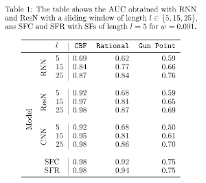

# Streaming time-series classification using dynamic time warping-based frames

[LINK TO PAPER]()

### Abstract

Using a reference time series, the streaming time-series is transformed into an image by computing the DTW measures 
among sub-sequences of both time series. These intermediate DTWs can be arranged into a highly informative matrix that 
can be interpreted as an image that grows with the streaming time-series. This growing image can be divided by using a 
sliding-window into fixed-sized images which we call streaming frames. We provide a versatile methodology that combines 
the streaming frames feature representation with image classifiers to deal with the streaming time-series classification 
problem.The proposed feature representation has obtained impressive results when combining with different image 
classifiers.

### Results



*SFC*: Streaming frames trained using a CNN <br>
*SFR*: Streaming frames trained suing a ResNet

----

### INSTALL

```
pip install -r requirements.txt
```

### USAGE

The source code in the directory `src`

##### 1) Dataset Creation

Run the script `generate_dataset.py`, change the following lines in order to change the dataset creation

```python
dataset_array = ['cbf']  # array containing the dataset name
rho_array = ['0.100']  # rho of Online-DTW
window_size_array = [5]  # sliding window size
base_pattern = False  # do not change
pattern_name = 'ABC' if base_pattern else ''  # Do not change
dataset_type = 'DTW'  # do not change
post_processing = ''  # do not change
```

**NOTE:** The dataset name can be one of the following:

```
1) arma              ----> 8 classes
2) synthetic_control ----> 6 classes
3) sines             ----> 5 classes
4) kohlerlorenz      ----> 5 classes
5) cbf               ----> 3 classes
6) two_patterns      ----> 4 classes
7) rational          ----> 4 classes
8) seasonal          ----> 4 classes
```
**GUNPOINT:** For using the dataset gunpoint create the dataset as described in 
_INSERT LINK OF PAPER OF GUNPOINT CREATION_
    
- ##### 1b) Dataset inspection
    
    Run the script `inspect_dataset.py` to plot the generated dataset for inspection, change the first lines accordingly:
    
    ```python
    dataset = 'cbf'  # dataset name
    base_pattern = False  # do not change
    pattern_name = ''  # do not change
    rho = '0.100'  # rho value
    dataset_type = 'DTW'  # do not change
    window_size = 25  # sliding window size
    ```

##### 2) Training

Run the script `train.py`, open the file `conf.yaml` to change the parameters of the training:

```yaml
dataset: 'cbf'  # dataset name NOTE that the dataset needs to be created first
dataset_type: 'DTW'  # do not change
rho: '0.100'  # rho value 
window_size: 5  # sliding window size
pattern_name: ''  # do not  change
network_type: 'ResNet'  # network type change into: [CNN or ResNet]
appendix_name: '1M'  # parameters size change into: ['1M' or '100k', ''] '' means maximum parameters

parameters:
  batch_size: 32
  scaler_dim: [0, 1]  # which dimension of the image flatten in order to normalized dataset, in this
                      # case normalize  on the channel
  preprocessing: True  # if to apply the normalization
  reload_images: False  # to not reload the image for normalization

epochs: 100  # epochs
```

**NOTE**: the training is already configured for using COMET.ml (tracking experiments website) so in order to activate 
it run the `train` function with the parameter `track_experiment=True` and in the file `models/runner.py` change:

```python
experiment = Experiment(api_key="YOUR_API_KEY",
                        project_name=project_name, workspace="YOUR_WORKSPACE",
                        disabled=True)
```

##### 2) Evaluate 

Run the script `evaluate.py`, this will evaluate a network trained which weights are saved (automatically during the
training) in the directory: <br>
`Network_weights/{dataset_name}/rho {value}/DTW_CNN_{window_size}_{network_type}_{appendix_name}` 

the last 4 parameters of the function: `evaluate`:

```python
...
evaluating=True,  # print the classification report
summary=True,  # summary of experiments (Loss_Acc, Conf matrices, ROC_AUC, classes' probability)
error=True,  #  error analysis (plot the wrong examples and the accuracy per distance)
explain=True) # visualize Activation MAP and other explaining plots
```

---

#### TESTS

The directory `tests` contains two files:
- `dataset_test.py` plots the image channel for each class against the raw time series value
- `label_test.py` check the integrity of the created dataset, checking the all the images have the correct label
                  depending on the value of the time series